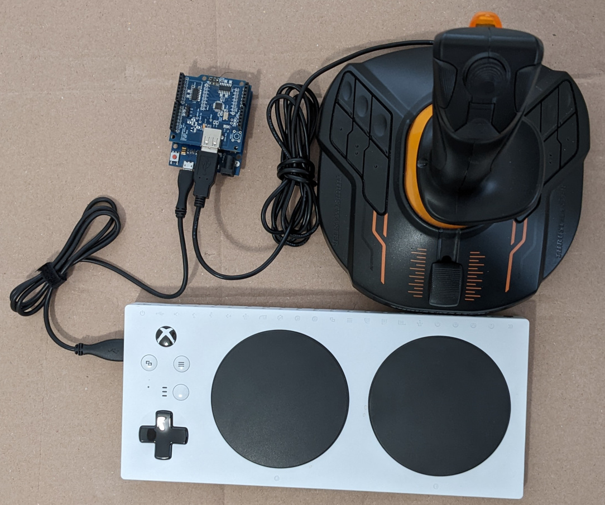

# Convert Big Joystick to Xbox Adaptive Controller Joystick

The only Big Joystick currently supported is the Thrustermaster T.16000M (T16K)
flight stick. The T16K does not work when plugged directly into the Xbox
Adaptive Controller (XAC). This project allows the XAC to talk to the T16K by
translating the T16K HID messages to HID messages the XAC understands.

One nice feature of the T16K is it can be configured for left or right hand
users. 

## Hardware

* Arduino Leonardo
* USB Host Shield
* Thrustmaster T.16000M flight stick

## Libraries

Install the following library using the IDE Library Manager.

* [USB Host Shield Library 2.0](https://github.com/felis/USB_Host_Shield_2.0)

Install the second one by following the [instructions here](https://github.com/MHeironimus/ArduinoJoystickLibrary#installation-instructions).

* [Arduino Joystick Library](https://github.com/MHeironimus/ArduinoJoystickLibrary)

